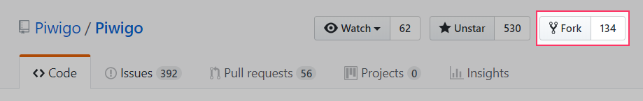
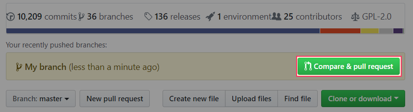

# Get the Piwigo project

## Prerequisites
To contribute to project, you will need to install on your computer [Git](https://git-scm.com/) and to have a [Github account](https://github.com/join?source=header-home).

If you don't really know how to use git, I will recommend you to check this [guide](https://git-scm.com/book/en/v2/Getting-Started-Git-Basics). If you are comfortable with git and GitHub, just go to "Create a pull request" section.

### How to configure Git

To add associate your GitHub account and your Git, you will need use this command on Git Bash:

- Set up your name:
`git config --global user.name "Firstname lastname"`

- Set up your e-mail address:
`git config --global user.email "email@example.com"`

### Get the project on your GitHub account
You have to click on the fork button of the [Piwigo GitHub](https://github.com/Piwigo/Piwigo).



### Get your forked project on your computer
Go where you want to work on the project (for example in your **www** folder) and enter this command (Don't forget to replace `username` with your GitHub username):

`git clone https://github.com/username/Piwigo`

## Create a branch

To avoid conflicts when updating your fork from the upstream, always work on a branch (from `master`).

```
git checkout master
git checkout -b issue-496-group-deletion
```
We recommend explicit name for your branch, such as `issue-<id>-<short-summary>`

Now, you can work on your new branch. Modify code, test your changes and commit locally. For each commit, prefix your log with the id of your issue, for example: `issue #496`. This will help the Piwigo team by automatically binding your changes with the issue.

Update your GitHub repository:

`git push origin <branch>`

## Create a pull request

On GitHub you should see your branch (with commits) that you pushed before like this:



Once you clicked the button "Compare & pull request", you have to give a name to the pull request.


Example name of a pull request: `Issue 965 manage group deletion`

If you forget something, don't worry: you can continue to push commits on your branch and it will automatically update your pull request.

Now the Piwigo team can review your pull request... and merge it!

## Tips

##### #1

If you had to update your fork because there is activity on the upstream, you can go to this link:
[syncing a fork](https://help.github.com/articles/syncing-a-fork/)

##### #2

When you finished your work and going to commit the final change. You can specify *Fixes* and the GitHub id of the original issue to help the Piwigo team. This will close automatically the pull request when this will be merged on the upstream.

Example of a last commit: `Fixes #965 Add a new column`
